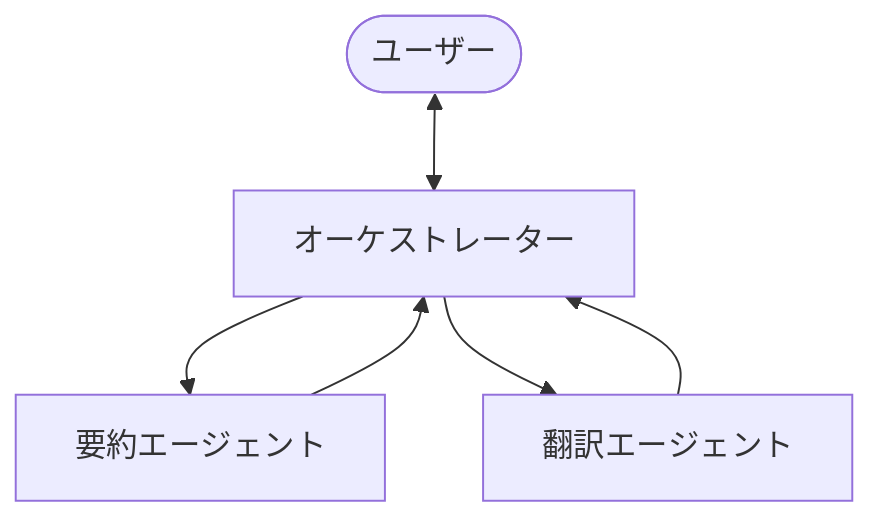

## はじめに

[前回の記事](/ja/blog/2026/03/03/strands-agents-conversation)では会話の記憶とコンテキスト管理を学んだ。ここまでのシリーズで、単一エージェントの機能はほぼ網羅した。

しかし、現実のタスクは 1 つのエージェントでは手に負えないことがある。「テキストを要約して、さらに日本語に翻訳して」のように、異なる専門性を持つ複数のエージェントが協調する方が効率的だ。

Strands Agents SDK では **Agents as Tools** パターンでこれを実現する。エージェントを `@tool` でラップして、別のエージェントのツールとして渡すだけだ。

公式ドキュメントは [Agents as Tools](https://strandsagents.com/docs/user-guide/concepts/multi-agent/agents-as-tools/) を参照。

## Agents as Tools とは

「Agents as Tools」は、専門エージェントをツール関数としてラップし、オーケストレーター（司令塔）エージェントから呼び出すパターンだ。



人間のチームに例えると、マネージャー（オーケストレーター）が専門家（要約担当、翻訳担当）に仕事を振り分ける構造だ。第 2 回で学んだ「ツールの責務を分離する」原則がそのままエージェントレベルに拡張される。

## セットアップ

[前回の記事](/ja/blog/2026/03/03/strands-agents-conversation)の環境をそのまま使う。

```python title="Python (共通設定)"
from strands import Agent, tool
from strands.models import BedrockModel

bedrock_model = BedrockModel(
    model_id="us.anthropic.claude-sonnet-4-20250514-v1:0",
    region_name="us-east-1",
)
```

## 専門エージェントをツールとして定義する

要約と翻訳の 2 つの専門エージェントを `@tool` でラップする。

```python title="Python (専門エージェント)"
@tool
def summarizer(text: str) -> str:
    """Summarize the given text into 2-3 concise sentences.

    Args:
        text: The text to summarize

    Returns:
        A concise summary
    """
    summary_agent = Agent(
        model=bedrock_model,
        system_prompt="You are a summarization specialist. "
        "Summarize the given text into 2-3 concise sentences. Be factual and precise.",
        callback_handler=None,
    )
    result = summary_agent(f"Summarize this: {text}")
    return result.message['content'][0]['text']

@tool
def translator(text: str, target_language: str) -> str:
    """Translate the given text into the specified language.

    Args:
        text: The text to translate
        target_language: The target language (e.g. Japanese, Spanish, French)

    Returns:
        The translated text
    """
    translation_agent = Agent(
        model=bedrock_model,
        system_prompt="You are a professional translator. "
        "Translate the given text accurately into the target language. "
        "Return only the translation, no explanations.",
        callback_handler=None,
    )
    result = translation_agent(f"Translate the following into {target_language}: {text}")
    return result.message['content'][0]['text']
```

ポイントは、各ツール関数の中で `Agent` を作成している点だ。外から見ればただの `@tool` 関数だが、中身は独自のシステムプロンプトを持つ専門エージェントである。オーケストレーターはこの内部構造を知らない。docstring を読んで「要約するツール」「翻訳するツール」として使うだけだ。

## オーケストレーターを作る

専門エージェントをツールとしてオーケストレーターに渡す。

```python title="Python (オーケストレーター)"
orchestrator = Agent(
    model=bedrock_model,
    system_prompt="You are an assistant that coordinates specialized agents. "
    "Use the summarizer tool for summarization tasks and the translator tool "
    "for translation tasks. You can chain them: summarize first, then translate the summary.",
    tools=[summarizer, translator],
    callback_handler=None,
)

text = (
    "Amazon Bedrock is a fully managed service that offers a choice of "
    "high-performing foundation models from leading AI companies like "
    "AI21 Labs, Anthropic, Cohere, Meta, Mistral AI, Stability AI, and "
    "Amazon through a single API, along with a broad set of capabilities "
    "you need to build generative AI applications with security, privacy, "
    "and responsible AI."
)

result = orchestrator(
    f"Summarize the following text, then translate the summary into Japanese:\n\n{text}"
)
```

`tools=[summarizer, translator]` — これまでのシリーズで `calculator` や `word_count` を渡したのと同じ方法だ。エージェントをツールとして渡すために特別な API は不要。`@tool` でラップするだけでよい。

### 実行結果

```text title="Output"
**Summary:** Amazon Bedrock is a fully managed service that provides access to
high-performing foundation models from leading AI companies including AI21 Labs,
Anthropic, Cohere, Meta, Mistral AI, Stability AI, and Amazon through a single
API. The service offers comprehensive capabilities for building generative AI
applications while maintaining security, privacy, and responsible AI practices.

**Japanese Translation:** Amazon Bedrockは、AI21 Labs、Anthropic、Cohere、Meta、
Mistral AI、Stability AI、およびAmazonを含む主要なAI企業の高性能基盤モデルに
単一のAPIを通じてアクセスを提供する完全管理サービスです。このサービスは、
セキュリティ、プライバシー、および責任あるAI慣行を維持しながら、生成AI
アプリケーションを構築するための包括的な機能を提供します。
```

```text title="Output (メトリクス)"
Cycles: 3
Tools used: ['summarizer', 'translator']
Tokens: 3294
```

オーケストレーターが 3 サイクルで処理を完了した。

- **Cycle 1**: オーケストレーターが推論し、`summarizer` を呼ぶ。内部で要約エージェントが動く
- **Cycle 2**: 要約結果を受け取り、`translator` を呼ぶ。内部で翻訳エージェントが動く
- **Cycle 3**: 翻訳結果を受け取り、最終回答を生成する

第 2 回で学んだマルチステップ動作（為替レート取得 → 変換）と同じパターンだ。違いは、各ツールの中身が単純な関数ではなく、独自のシステムプロンプトを持つエージェントであること。

## シリーズの振り返り

全 5 回で Strands Agents SDK の基本を一通り学んだ。

| 回 | テーマ | 学んだこと |
|---|---|---|
| [第 1 回](/ja/blog/2026/03/03/strands-agents-quickstart) | Quickstart | エージェントループ、`@tool`、メトリクス |
| [第 2 回](/ja/blog/2026/03/03/strands-agents-custom-tools) | カスタムツール | マルチステップ、エラー処理、システムプロンプト |
| [第 3 回](/ja/blog/2026/03/03/strands-agents-mcp-tools) | MCP | 外部ツール接続、自作ツールとの併用 |
| [第 4 回](/ja/blog/2026/03/03/strands-agents-conversation) | 会話管理 | マルチターン、SlidingWindow |
| 第 5 回（本記事） | マルチエージェント | Agents as Tools、オーケストレーター |

ここから先は [Swarm](https://strandsagents.com/docs/user-guide/concepts/multi-agent/swarm/) や [Graph](https://strandsagents.com/docs/user-guide/concepts/multi-agent/graph/) パターン、[セッション管理](https://strandsagents.com/docs/user-guide/concepts/agents/session-management/)、[オブザーバビリティ](https://strandsagents.com/docs/user-guide/observability-evaluation/observability/) など、より高度なトピックに進むことができる。

## まとめ

- **エージェントを `@tool` でラップするだけでマルチエージェントになる** — 特別な API は不要。これまで学んだ `@tool` の知識がそのまま使える。
- **オーケストレーターが専門家を自律的に選ぶ** — システムプロンプトと docstring に基づいて、オーケストレーターが適切な専門エージェントを呼び出す。呼び出し順序をコードで指定する必要はない。
- **専門エージェントは独自のシステムプロンプトを持てる** — 要約エージェントには「簡潔に」、翻訳エージェントには「翻訳のみ返す」といった専門的な指示を与えられる。
- **シリーズ全体の知識が積み重なる** — ツール設計（第 2 回）、エラー処理（第 2 回）、システムプロンプト（第 2 回）、マルチステップ動作（第 2 回）、メトリクス（第 1 回）がすべてマルチエージェントでも活きる。
