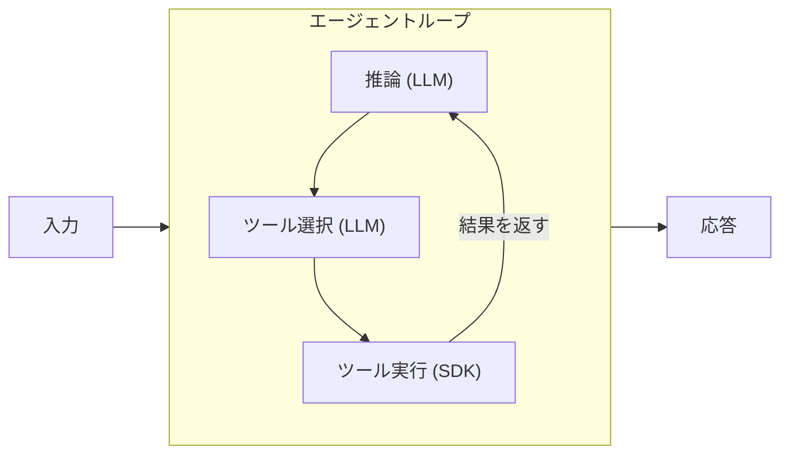

## はじめに

AI エージェントフレームワークが乱立する中、AWS がオープンソースで公開した [Strands Agents SDK](https://strandsagents.com/) は「モデルに道具を渡して、あとは任せる」というシンプルな設計が特徴である。Python と TypeScript の両方に対応し、Amazon Bedrock（デフォルトは Claude 4）をデフォルトのモデルプロバイダーとしつつ、OpenAI や Ollama など多数のプロバイダーも選択できる。

この記事では [Python Quickstart](https://strandsagents.com/docs/user-guide/quickstart/python/) を実際に手を動かして試し、コードの意味やエージェントの内部動作を初心者向けに解説する。

## Strands Agents SDK とは

Strands Agents SDK は、LLM（大規模言語モデル）に「ツール」を渡して自律的にタスクを遂行させるフレームワークである。核となるのは **エージェントループ** という仕組みだ。



1. ユーザーの入力を LLM に渡す
2. LLM が「この質問に答えるにはどのツールが必要か」を判断する
3. 選んだツールを実行し、結果を LLM に返す
4. LLM が結果を見て、さらにツールが必要なら 2 に戻る。十分なら最終回答を生成する

このループが繰り返されることで、単なる Q&A ではなく「複数ステップの推論と行動」が可能になる。

## セットアップ

前提条件:

- Python 3.10 以上
- AWS CLI が設定済みで、Bedrock の Claude モデルへのアクセス権限があること

```bash title="Terminal (インストール)"
mkdir my_agent && cd my_agent
python -m venv .venv
source .venv/bin/activate
pip install strands-agents strands-agents-tools
```

`strands-agents` が SDK 本体、`strands-agents-tools` がコミュニティ提供のツール集（電卓、現在時刻取得など）である。今回インストールされたバージョンは `strands-agents==1.32.0` だった。

## エージェントを作る

Quickstart のコードをベースに、実際に動かしてみる。公式 Quickstart では `Agent(tools=[...])` とデフォルトの Bedrock プロバイダー（Claude 4 Sonnet、リージョン未指定時は `us-west-2`）を使うが、今回はリージョンとモデル ID を明示的に指定する形に変更した。

`agent.py` を作成する。以下ではコードを 3 パートに分けて解説するが、すべて 1 つの `agent.py` に記述する。末尾に全体コードの折りたたみも用意した。

### カスタムツールの定義

`@tool` デコレータを付けた Python 関数がそのままエージェントのツールになる。

```python title="agent.py (1/3: カスタムツール)"
from strands import Agent, tool
from strands.models import BedrockModel
from strands_tools import calculator, current_time

@tool
def letter_counter(word: str, letter: str) -> int:
    """
    Count occurrences of a specific letter in a word.

    Args:
        word (str): The input word to search in
        letter (str): The specific letter to count

    Returns:
        int: The number of occurrences of the letter in the word
    """
    if not isinstance(word, str) or not isinstance(letter, str):
        return 0
    if len(letter) != 1:
        raise ValueError("The 'letter' parameter must be a single character")
    return word.lower().count(letter.lower())
```

ここで重要なのは **docstring** だ。LLM はこの説明文を読んで「このツールは何ができるのか」「どんなパラメータを渡せばいいのか」を判断する。型ヒント（`str`, `int`）も LLM がパラメータを正しく渡すために使われる。つまり、docstring と型ヒントがツールの「取扱説明書」になる。

### モデルとエージェントの設定

```python title="agent.py (2/3: モデル設定)"
bedrock_model = BedrockModel(
    model_id="us.anthropic.claude-sonnet-4-20250514-v1:0",
    region_name="us-east-1",
)

agent = Agent(model=bedrock_model, tools=[calculator, current_time, letter_counter])
```

`Agent` にモデルとツールのリストを渡すだけでエージェントが完成する。公式 Quickstart のオリジナルコードでは `BedrockModel` を使わず `Agent(tools=[...])` とだけ書いてもよい。

### プロンプトの送信と実行

```python title="agent.py (3/3: 実行)"
message = """
I have 3 requests:

1. What is the time right now?
2. Calculate 3111696 / 74088
3. Tell me how many letter R's are in the word "strawberry"
"""
result = agent(message)

# メトリクスを確認する場合は以下を追加
import json
print(json.dumps(result.metrics.get_summary(), indent=2, default=str))
```

`agent(message)` と関数呼び出しのようにプロンプトを渡すだけで、エージェントループが回り始める。

<details className="my-4 rounded-lg border border-border bg-muted/30 p-4">
<summary className="cursor-pointer font-medium">agent.py 全体コード（コピペ用）</summary>

```python title="agent.py"
from strands import Agent, tool
from strands.models import BedrockModel
from strands_tools import calculator, current_time
import json

@tool
def letter_counter(word: str, letter: str) -> int:
    """
    Count occurrences of a specific letter in a word.

    Args:
        word (str): The input word to search in
        letter (str): The specific letter to count

    Returns:
        int: The number of occurrences of the letter in the word
    """
    if not isinstance(word, str) or not isinstance(letter, str):
        return 0
    if len(letter) != 1:
        raise ValueError("The 'letter' parameter must be a single character")
    return word.lower().count(letter.lower())

bedrock_model = BedrockModel(
    model_id="us.anthropic.claude-sonnet-4-20250514-v1:0",
    region_name="us-east-1",
)

agent = Agent(model=bedrock_model, tools=[calculator, current_time, letter_counter])

message = """
I have 3 requests:

1. What is the time right now?
2. Calculate 3111696 / 74088
3. Tell me how many letter R's are in the word "strawberry"
"""
result = agent(message)

print("\n\n--- Metrics Summary ---")
print(json.dumps(result.metrics.get_summary(), indent=2, default=str))
```

</details>

## 実行結果

```bash title="Terminal"
python -u agent.py
```

```text title="Output"
I'll help you with all three requests. Let me use the available tools.
Tool #1: current_time
Tool #2: calculator
Tool #3: letter_counter

1. Current time: March 22, 2026 at 10:08:35 AM UTC
2. Calculation: 3,111,696 ÷ 74,088 = 42
3. Letter count: The word "strawberry" contains 3 letter R's
```

注目すべきは、エージェントが 3 つのツールを **並列に** 呼び出している点だ。LLM が「3 つの質問にはそれぞれ別のツールが必要」と判断し、1 回の推論サイクルで 3 つのツール呼び出しをまとめて要求した。

## メトリクスで内部動作を理解する

上記コードの末尾で `result.metrics.get_summary()` を出力している。この結果からエージェントの動作を詳細に確認できる。

<details className="my-4 rounded-lg border border-border bg-muted/30 p-4">
<summary className="cursor-pointer font-medium">メトリクス出力（抜粋）</summary>

```json title="Output"
{
  "total_cycles": 2,
  "total_duration": 6.28,
  "accumulated_usage": {
    "inputTokens": 4289,
    "outputTokens": 265,
    "totalTokens": 4554
  },
  "tool_usage": {
    "calculator": {
      "execution_stats": {
        "call_count": 1,
        "success_count": 1,
        "error_count": 0,
        "total_time": 0.004,
        "average_time": 0.004,
        "success_rate": 1.0
      }
    },
    "current_time": {
      "execution_stats": {
        "call_count": 1,
        "success_count": 1,
        "error_count": 0,
        "total_time": 0.005,
        "average_time": 0.005,
        "success_rate": 1.0
      }
    },
    "letter_counter": {
      "execution_stats": {
        "call_count": 1,
        "success_count": 1,
        "error_count": 0,
        "total_time": 0.001,
        "average_time": 0.001,
        "success_rate": 1.0
      }
    }
  }
}
```

</details>

**サイクル数が 2** であることに注目してほしい。

- **Cycle 1**: LLM が推論し、3 つのツールを呼び出す。ツールの結果が会話履歴に追加される
- **Cycle 2**: ツールの結果を受け取った LLM が最終回答を生成する

これがエージェントループの実体だ。「推論 → ツール実行 → 推論」の 2 サイクルで完了している。合計 4,554 トークンを消費し、所要時間は約 6.3 秒だった。

## ハマりポイント

実際に試して遭遇した問題を共有する。

### モデル ID のプレフィックス

Bedrock でオンデマンドスループット（推論プロファイルを使わない直接呼び出し）を使う場合、モデル ID に `us.`（クロスリージョン推論プロファイル）のプレフィックスが必要だ。クロスリージョン推論プロファイルとは、複数リージョンにまたがって推論リクエストを自動ルーティングする仕組みで、Claude 4 などの新しいモデルではこの方式が必須になっている。`anthropic.claude-sonnet-4-20250514-v1:0` をそのまま指定すると以下のエラーが発生する。

```text title="Output"
ValidationException: Invocation of model ID anthropic.claude-sonnet-4-20250514-v1:0
with on-demand throughput isn't supported.
Retry your request with the ID or ARN of an inference profile that contains this model.
```

解決策は `us.anthropic.claude-sonnet-4-20250514-v1:0` のようにプレフィックスを付けること。Strands のエラーメッセージにも[解決策のリンク](https://strandsagents.com/docs/user-guide/concepts/model-providers/amazon-bedrock/#on-demand-throughput-isnt-supported)が含まれている。

## まとめ

- **数十行でエージェントが動く** — `Agent` + `@tool` + モデル指定だけで、ツールを自律的に使い分ける AI エージェントが完成する。フレームワークの学習コストが低い。
- **エージェントループが核** — 「推論 → ツール選択 → 実行 → 推論」のサイクルが自動で回る。開発者はツールの実装に集中すればよい。
- **メトリクスが充実** — サイクル数、トークン使用量、ツールごとの成功率・実行時間が標準で取得できる。本番運用時のデバッグや最適化に役立つ。
- **Bedrock のモデル ID に注意** — クロスリージョン推論プロファイルのプレフィックス（`us.` など）を忘れると動かない。公式ドキュメントの [Bedrock プロバイダーページ](https://strandsagents.com/docs/user-guide/concepts/model-providers/amazon-bedrock/) を確認しておくとよい。
